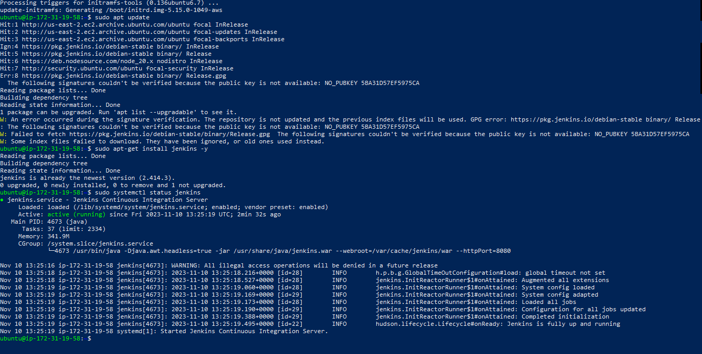

# CI-CD WITH JENKINS
1. Launch an instance and name it Jenkins

2. ssh into your instance on powershell

- run the following commands
- `sudo apt update` To download and update your application from all configured sources.
- run this command
- `sudo apt install default-jdk-headless-y`
- this is to installs the default OpenJDK package without any unnecessary graphical components, making it suitable for server environments or systems without a GUI.

3. install Jenkins with this commands
```
wget -q -O - https://pkg.jenkins.io/debian-stable/jenkins.io.key | sudo apt-key add -
sudo sh -c 'echo deb https://pkg.jenkins.io/debian-stable binary/ > \
    /etc/apt/sources.list.d/jenkins.list'

```
- then update again
- `sudo apt update`

- run this commands
- `sudo apt upgrade -y`
- `sudo apt update`
- `sudo apt-get install jenkins -y`
- ensure that your jenkins is up and ruuning by now run this command
- `sudo systemctl status jenkins`



4. from your browser copy your EC2 public IP address and paste, add :8080 because by default jenkins runs on this port. This must be done with your inbound rules set in your EC2 security group allowing http.

- Note if its your first time of logging into jenkins your page will be different as you have to unlock jenkins by copying the password given to you and pasting at the column provide and press continue. then follow the promt.
- to retreive the password use this command
```
sudo cat /var/lib/jenkins/secrets initialAdminPassword
``` 

