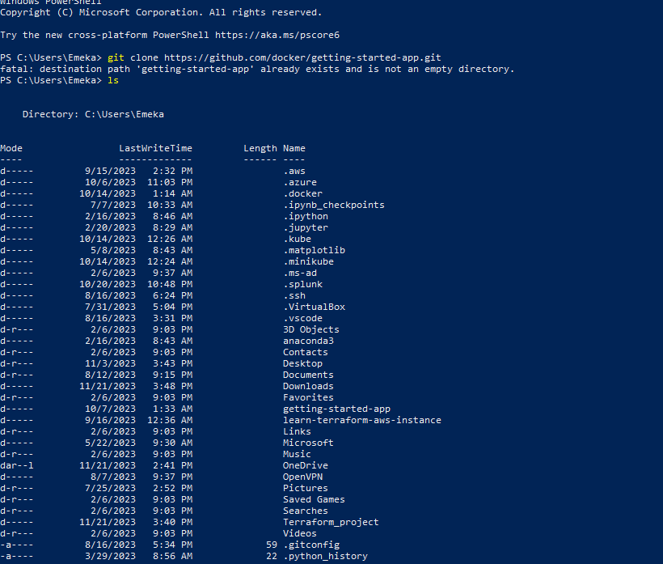
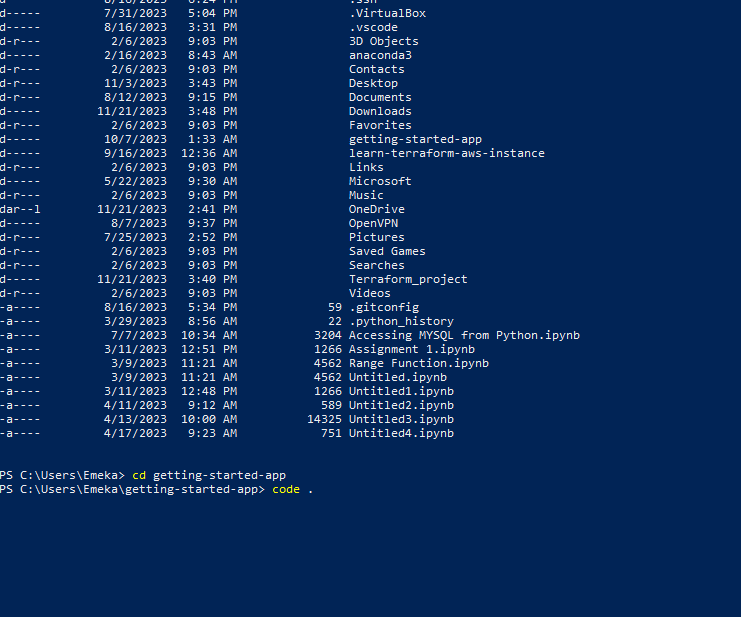
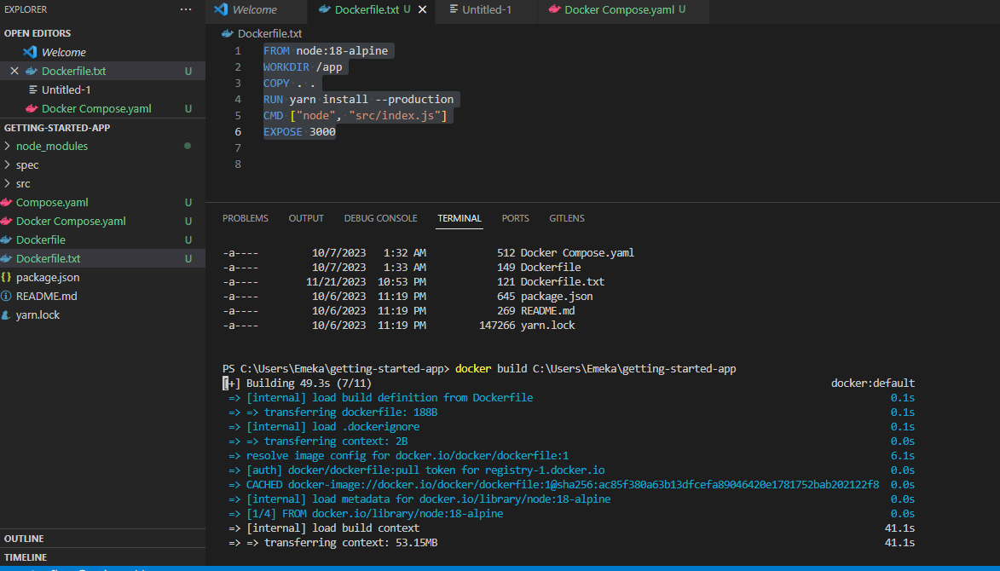
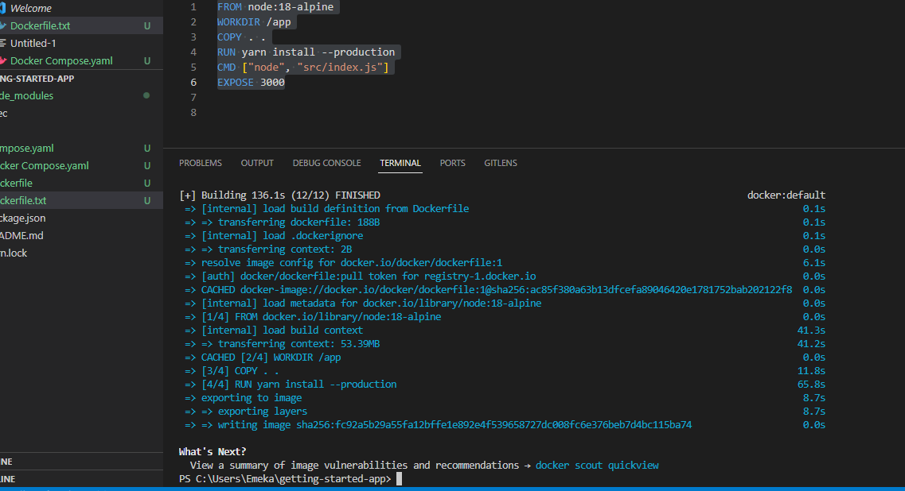
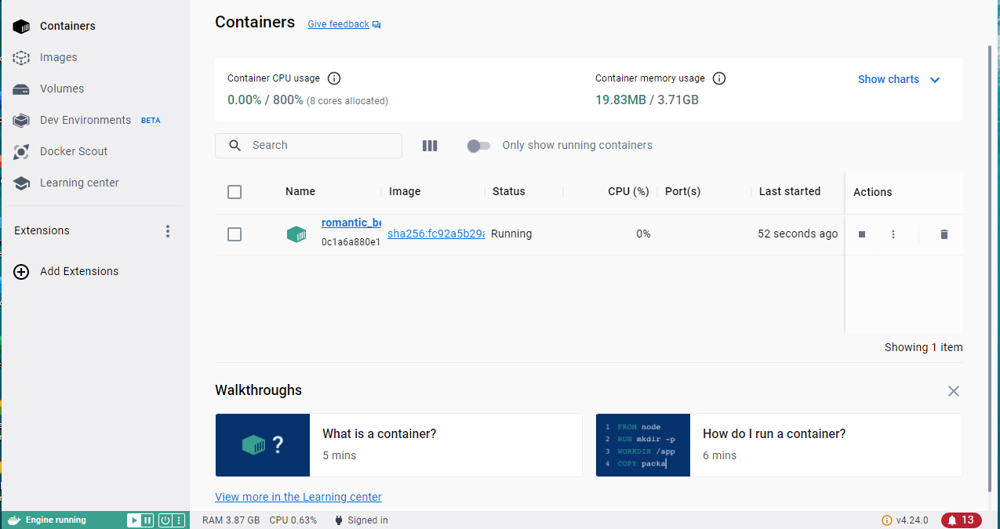
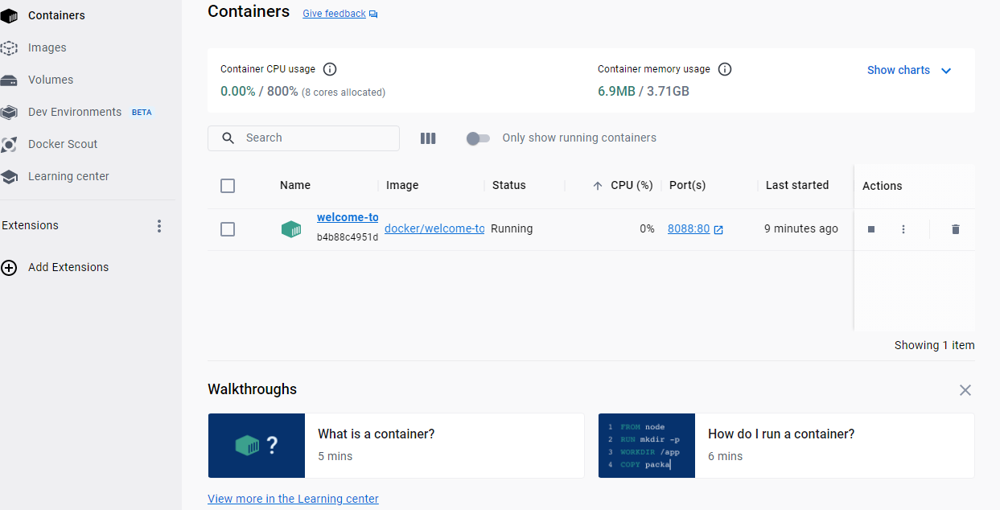
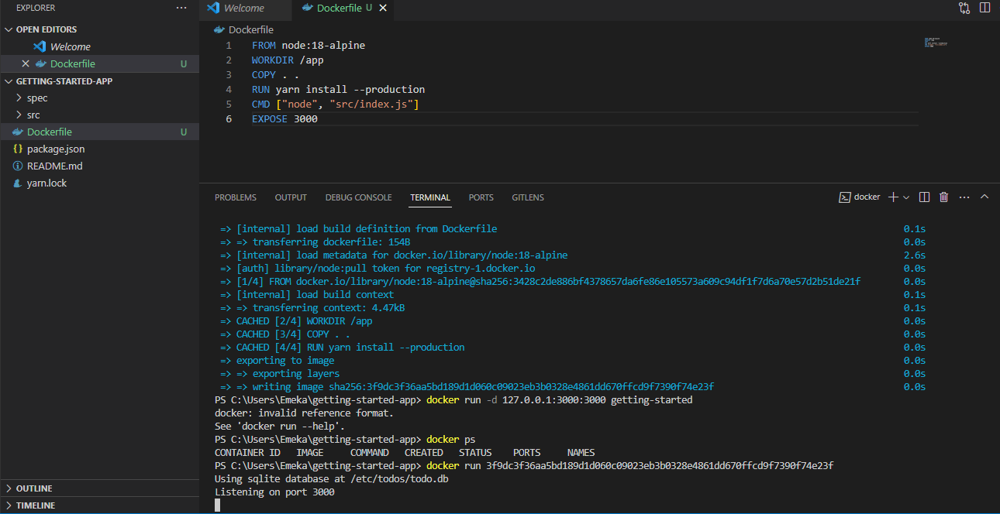
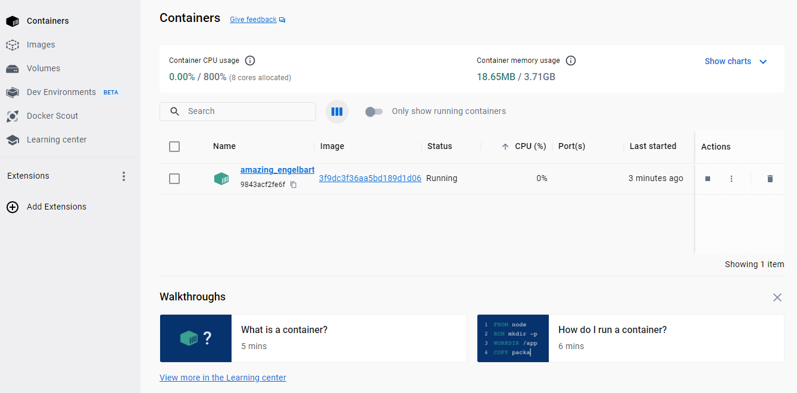

# DOCKER
1. To start Docker, you need to ensure that the Docker Engine is installed on your system. 
2. You also need to install WSL since you are going to run your containers use linux mode. Docker Desktop typically uses WSL 2 as the backend to host a lightweight Linux kernel.
This allows you to run Linux containers on Windows seamlessly
3. Make sure your docker desktop is already running and you have logged into it.
- We would be cloning an existing repository for this project so we use this commands in Powershell:
    ```
    git clonehttps://github.com/docker/getting-started-app.git
    ```
    `ls`

    `cd getting-started-app`

    `code .`


4. the last command opened ws code terminal and we will create a file named dockerfile and paste the following:
    ```
    FROM node:18-alpine
    WORKDIR /app
    COPY . .
    RUN yarn install --production
    CMD ["node", "src/index.js"]
    EXPOSE 3000

    ```
    
    - Open your terminal and run the following commands:
- Build your container image
    ```
    docker build C:\Users\Emeka\getting-started-app
    ```
    
    
- Run your container
- docker run -dp 127.0.0.1:3000:3000 getting-started



