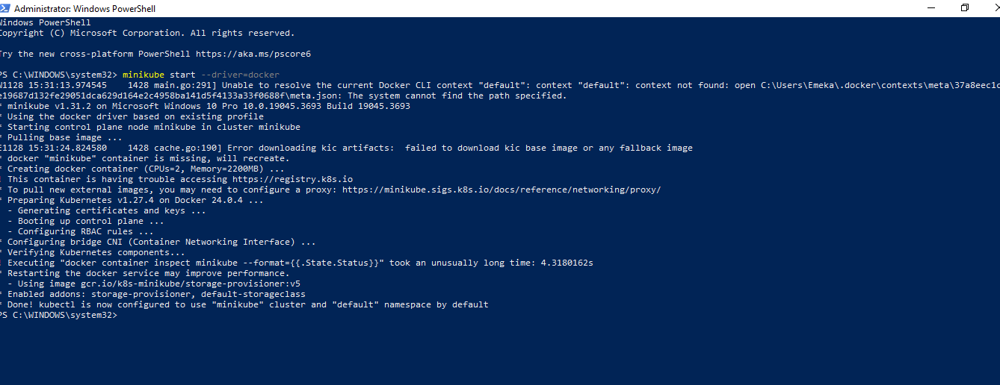

1. We would be making use of minkube to run our kubernetes commands
2. Open Powershell
3. Ensure your docker desktop is running
    - Ensure that your minikube is installed and you have to start it with docker with this command
 - ` minikube start --driver=docker`

4. Check the verion of your application and also the nodes with this commands
    - kubectl version
    - kubectl get nodes
5. also create deployment by this command
    - `kubectl create deployment kubernets-bootcamp`
6. To view and decsribe your deployment, run this commands:
    - `kubectl get deployment`
    - `kubectl describe deployment kubernetes-bootcamp`

7. check your docker desktop dashboard

8. We can also check our pods, logs and have access to the container either to modify or do other changes by running these commands:
    - `kubectl get pods`
    -  `kubectl describe pods`
    - `kubectl logs kubernetes-bootcamp-container id`
    - `kubectl exec kubernetes-bootcmap-container id`

9. We expose our application to the public
    - `kubectl expose deployment/kubernetes-bootcamp --type="NodePort" --port 8080`

10. Also access the services running on clusters
    - `kubectl get services`

11. check your labes and describe and delete your pods

12. scale your deployment to 6 replicas

13. Update to version 4
    - `kubectl set image deployments/kubernetes-bootcamp kubernetes-bootcamp=jocatalin/kubernetes-bootcamp:v4`

    # Done
