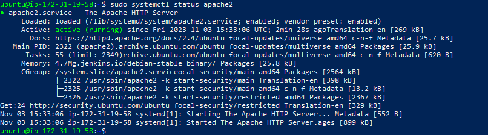
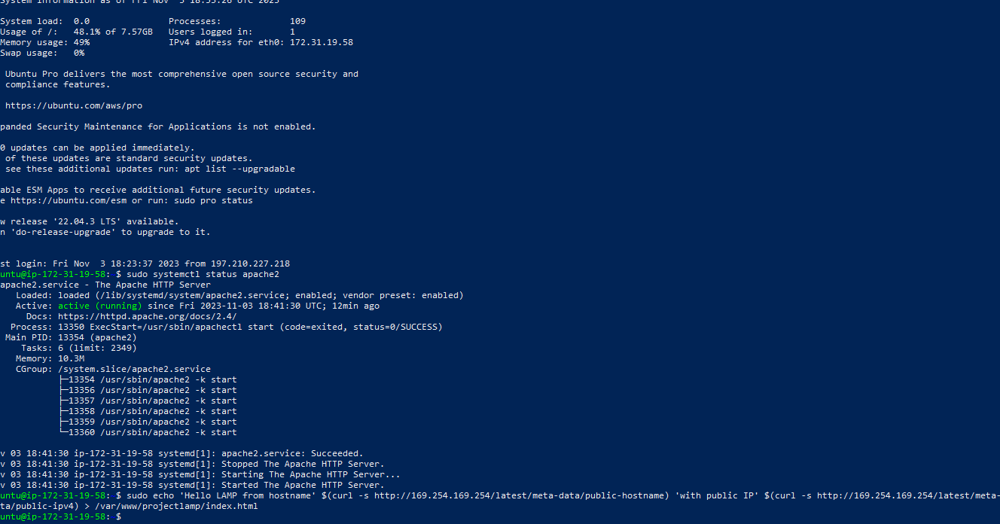

# LAMP STACK
## EC2 INSTANCE PROVISIONING
. Launch an instance


[ec2 inst](5.png)

1. Open your Powershell
    - ssh into your insatnce  noting your pem file
 
2. Run the command
- `sudo apt update` To download package information from all configured sources.

- `sudo systemctl status apache2` To check the status of your apache2 

- curl http://localhost:80 to check if your apache page is ruuning

# Install MY SQL
1. Run this commands
- ```sudo install mysql server```
- ```sudo mysql```

2. Also run 
- `sudo mysql_secure_installation` mysql_secure_installation is a shell script developed for securing the MySQL server installation on Unix systems. The script configures security settings and allows you to set a password for root accounts, type your password and follow the promt.

3. then login to mysql
- `sudo mysql -p`

4. Run `php -v`
- this is to check the version of PHP that you have in your system.

- the LAMP stack is fully installed and operational.
- You can also just do some final check on your system status.
5. create an echo 'hello LAMP from hostname' 
- `sudo echo 'hello LAMP from host name`
- cd into it and ensure you get the response.

6.  Our new website is now active, but the web root /var/www/projectlamp is still empty. Lets create an index.html file in that location so that we can test that the virtual host works as expected sudo echo 'Hello LAMP from hostname' $(curl -s http://169.254.169.254/latest/meta-data/public-hostname) 'with public IP' $(curl -s http://169.254.169.254/latest/meta-data/public-ipv4) > /var/www/projectlamp/index.html
Check your browser afterwards http://EC2-Public-IP-Address:80
7. Enable your PHP on the web
- run this command
```
<IfModule mod_dir.c>

#Change this:

#DirectoryIndex index.html index.cgi index.pl index.php index.xhtml index.htm

#To this:

DirectoryIndex index.php index.html index.cgi index.pl index.xhtml index.htm

</IfModule>

```
- save and close the file then reload your appache2 by running this command
- `sudo systemctl reload apache2`
- Create a new file named index.php inside your custom web root folder nano /var/www/projectlamp/index.php
- Opens a blank file. Paste the following code in there:
```
<?php

phpinfo();
```
- save, close the file and refresh and you will see a page just like this:

8. Remove the php page from the website when you are done because it contains some sensitive information about your system with this command
- `sudo rm /var/www/projectlamp/index.php`
# We are done and weldone.