# Terraform
1. To use terraform you must first download it, extract it from the zipped file and move the terraform binary to a directory listed in your system's PATH
2. Use any terminal of your choice and run the following commands:
- `sudo mv terraform /usr/local/bin/` 
- this is to verify installation
- `terraform --version`
- this is check the version installed.
- create a directory in your terminal name terraform_project with this command
- `mkdir terraform_project`
- cd into the directory with this command
- `cd terraform_project`
- then connect to your vs code with this
- `code .`
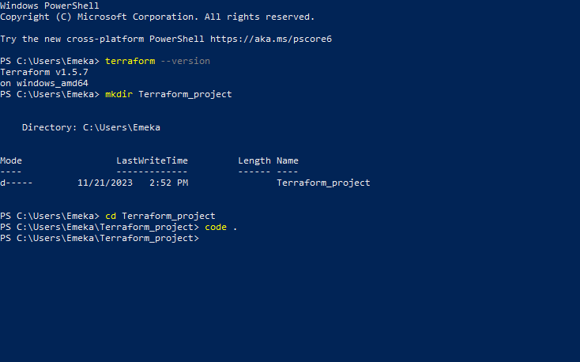
3. Create a file in your folder named "main.tf"
- Copy and paste the following code:
```
terraform {
 required_providers {
 aws = {
  source  = "hashicorp/aws"
  version = "~> 4.16"
  }
}
 required_version = ">= 1.2.0"
}

provider "aws" {
/* access_key = *****************
secret_key = ************************
*/
region = "us-east-2"

}

resource "aws_instance" "example_server" {
ami           = "ami-0fb653ca2d3203ac1"
instance_type = "t2.micro"

tags = {
Name = "ProjectExample"
  }
}
```
- NOTE: Where you have access_key and secret_key, you have to replace it with your aws access and secret key.
- Save your file and open your vs code terminal from "Veiw"on the menu bar.

- Run the following commands in your terminal
- `terraform init`
- `terraform fmt`
- `terraform validate`
- `terraform plan`
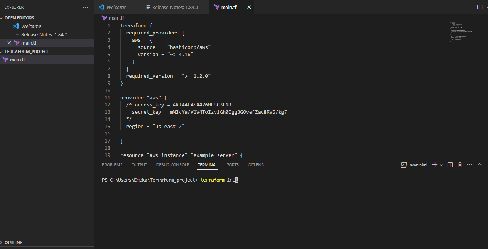
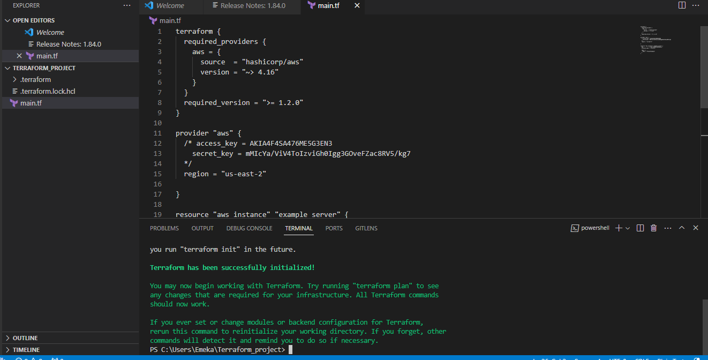
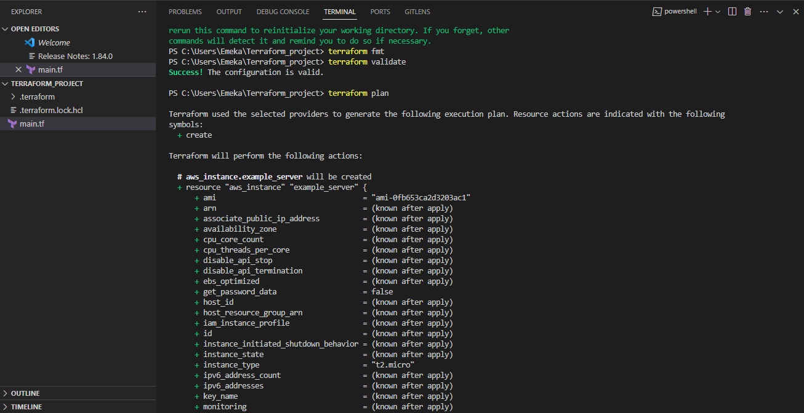
- the run 
- `terraform apply`
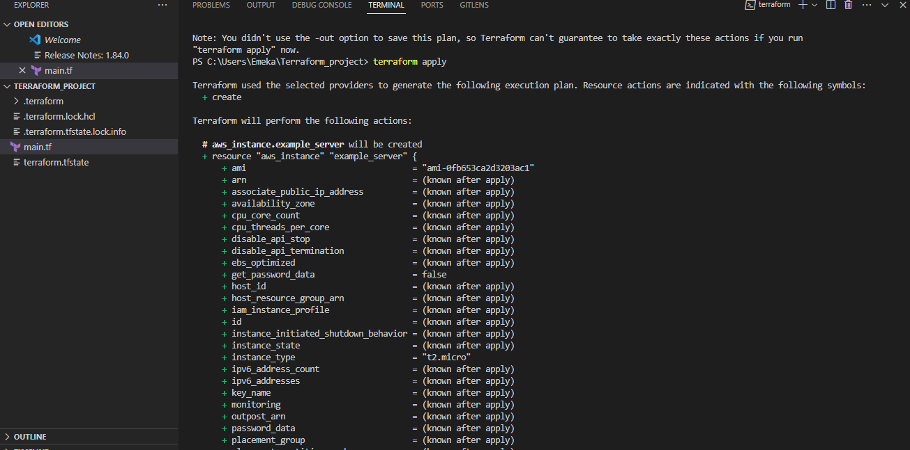
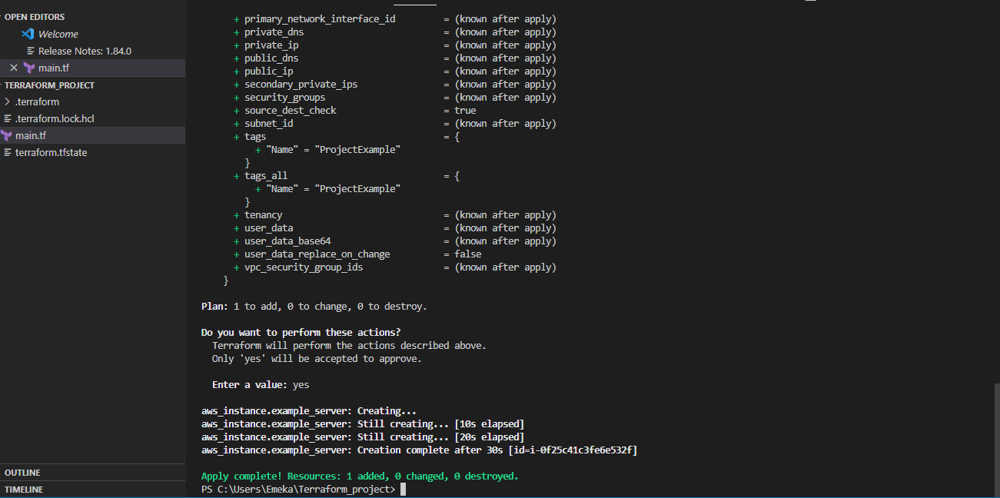
4. Login into your aws console if not logged into or check ec2 instances if you have logged in to see if the instance you provisioned is running. 
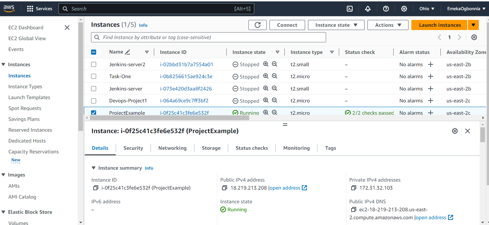
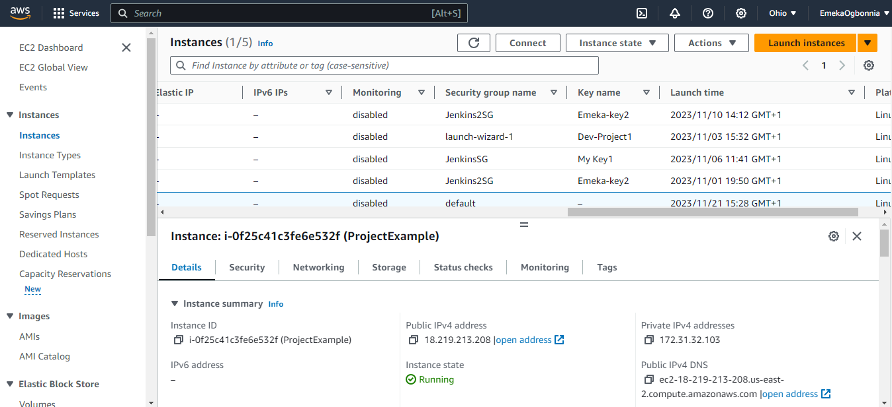
5. When you are done, you have to destroy your Ec2 Instance. After doing this, you would notice that your instance has been terminated on your AWS console.
- run this command
- `terraform destroy`
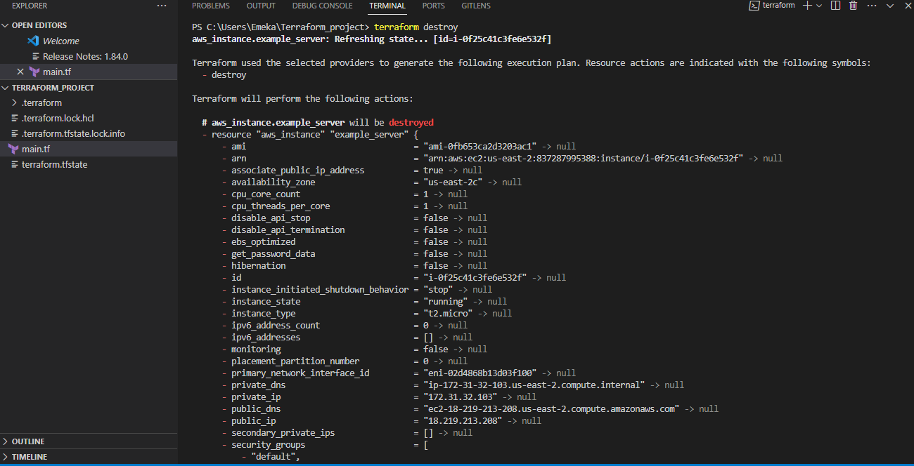
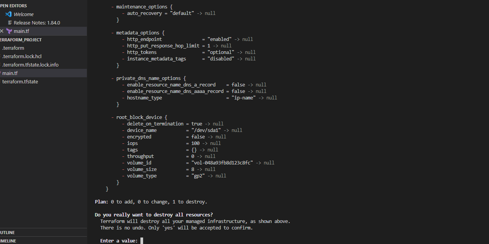
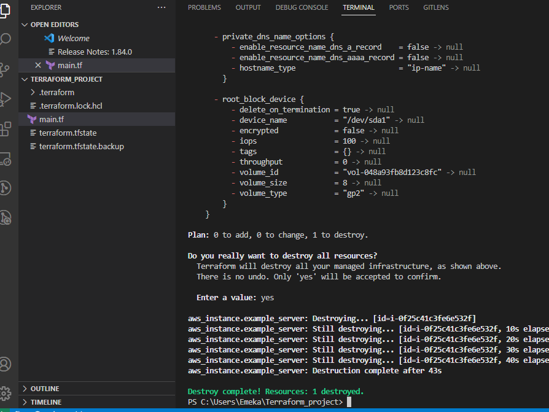
- then go back to your aws console and refresh your browser to check if the instance created has been destroyed.
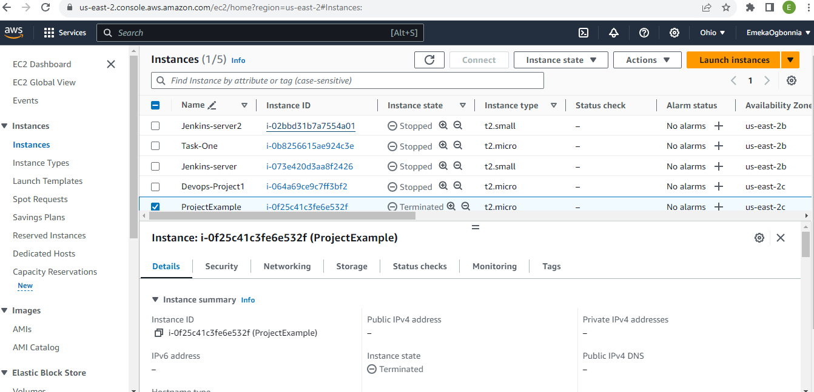
# Done
